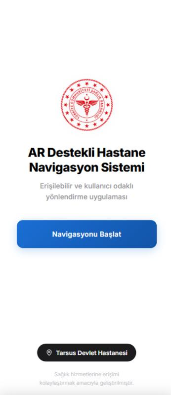
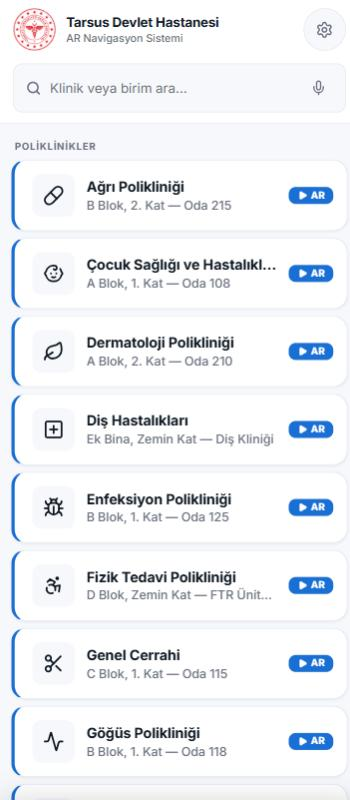
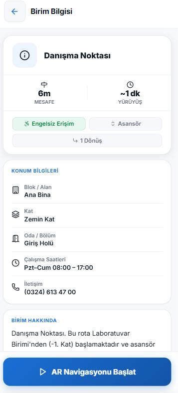
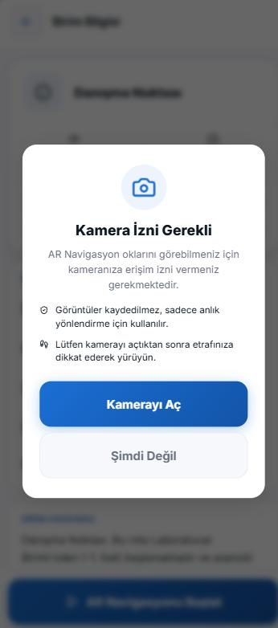
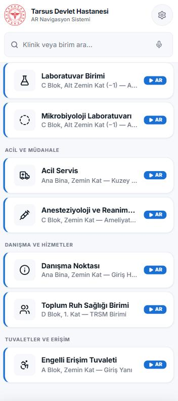
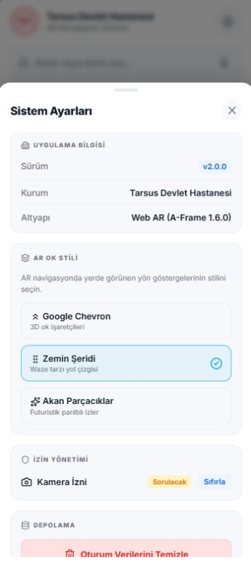
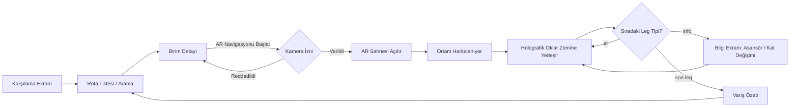

# 🏥 AR Destekli Hastane Navigasyon Sistemi

**Tarsus Devlet Hastanesi** için geliştirilmiş, WebXR tabanlı artırılmış gerçeklik (AR) ile engelsiz ve kullanıcı odaklı iç mekân yönlendirme sistemi.

Bu proje bir **doktora tezi prototipidir**: hastane içinde yön bulmakta zorlanan hasta ve yakınlarına, kamerayı yere doğru tutarak takip edebilecekleri holografik oklarla adım adım rota gösterir — herhangi bir uygulama kurulumu gerekmeden, doğrudan tarayıcıdan.

<p align="center">
  
  
  
  
</p>

<p align="center">
  
  
  
  
</p>

---

## 📖 İçindekiler

- [Proje Hakkında](#-proje-hakkında)
- [Öne Çıkan Özellikler](#-öne-çıkan-özellikler)
- [Ekran Görüntüleri](#-ekran-görüntüleri)
- [Nasıl Çalışır?](#-nasıl-çalışır)
- [Teknoloji Yığını](#-teknoloji-yığını)
- [Proje Yapısı](#-proje-yapısı)
- [Kurulum ve Çalıştırma](#-kurulum-ve-çalıştırma)
- [Yeni Rota Ekleme](#-yeni-rota-ekleme)
- [Yol Haritası](#-yol-haritası)
- [Sınırlılıklar](#-sınırlılıklar)
- [Künye](#-künye)
- [Lisans](#-lisans)

---

## 📌 Proje Hakkında

Büyük hastane kampüslerinde yön bulmak; farklı bloklar, katlar ve koridorlar arasında kaybolan hastalar için önemli bir erişilebilirlik sorunudur. Bu proje, **statik tabela sistemlerinin yerini almayı değil onu tamamlamayı** hedefler: kullanıcı telefonunun kamerasını açtığında, zeminde beliren oklar/parçacık izleri onu gideceği birime kadar adım adım götürür.

Uygulama tamamen **tarayıcı içi WebXR** üzerine kuruludur — native bir iOS/Android uygulaması değildir, native app mağaza onayı gerektirmez ve bir **PWA (Progressive Web App)** olarak ana ekrana eklenip çevrimdışı da çalışabilir.

## ✨ Öne Çıkan Özellikler

| Kategori | Açıklama |
|---|---|
| 🧭 **AR Navigasyon** | WebXR `hit-test` + `local-floor` ile zeminde konumlanan holografik yön okları; mesafe, kalan süre ve pusula verisi gerçek zamanlı güncellenir. |
| 🎨 **3 Farklı Ok Stili** | Kullanıcı; 3D chevron okları, Waze tarzı zemin şeridi veya akan parçacık efektleri arasından tercih yapabilir (Ayarlar panelinden). |
| 🏢 **Çok Adımlı Rotalar (`legs`)** | Rotalar birden fazla segmentten oluşabilir; asansör/kat değişimi gibi AR ile takip edilemeyen adımlarda sistem otomatik olarak bir **bilgi ekranına** geçer, kullanıcıyı yönlendirir ve ardından AR'a geri döner. |
| 🔎 **Anlık Arama** | 30+ klinik/birim arasında canlı arama; kategori bazlı gruplanmış liste görünümü. |
| ♿ **Erişilebilirlik Odaklı** | Her birim için "Engelsiz Erişim" / "Asansör" rozetleri, tam ARIA etiketleme, ekran okuyucu uyumlu canlı bölgeler (`aria-live`). |
| 📱 **PWA Desteği** | Service worker ile önbellekleme, ana ekrana ekleme (Android + iOS yönergeli), çevrimdışı çalışma ve otomatik güncelleme bildirimi. |
| ⚙️ **Ayarlar Paneli** | Kamera izni durumunu görüntüleme/sıfırlama, oturum verisi temizleme, AR ok stili seçimi — tek bir bottom-sheet içinde. |
| 🏁 **Varış Özeti** | Rota tamamlandığında kat edilen mesafe, geçen süre ve varış noktası bilgisiyle özet ekranı. |

## 📸 Ekran Görüntüleri

<table>
  <tr>
    <td align="center"><br><sub><b>Karşılama Ekranı</b></sub></td>
    <td align="center"><br><sub><b>Rota Listesi — Poliklinikler</b></sub></td>
    <td align="center"><br><sub><b>Kategori Bazlı Liste</b></sub></td>
  </tr>
  <tr>
    <td align="center"><br><sub><b>Birim Detayı</b></sub></td>
    <td align="center"><br><sub><b>Kamera İzni Modalı</b></sub></td>
    <td align="center"><br><sub><b>Sistem Ayarları</b></sub></td>
  </tr>
</table>

## 🔄 Nasıl Çalışır?



Rota verisi `config.js` içinde tanımlanan `NAV_ROUTES` dizisinden gelir. Her rota, sırayla işlenen `legs` (bacak/segment) listesinden oluşur:

- **`"ar"`** — Kamera açılır, A-Frame sahnesine `path` koordinatlarına göre yön okları çizilir, kullanıcı segmenti tamamlayınca bir sonraki lege geçilir.
- **`"info"`** — AR ile takip edilemeyen bir adım (ör. asansöre binme) için duraklama ekranı gösterilir; kullanıcı "Devam Et" dediğinde navigasyon kaldığı yerden sürer.

Şu an **4 birim** (Nöroloji Polikliniği, Engelli Erişim Tuvaleti, Laboratuvar Birimi, Danışma Noktası) tam AR rotasıyla aktif; geri kalan **29 birim** liste/detay ekranında bilgi amaçlı gösterilir (`isAvailable: false`) ve kademeli olarak AR'a taşınmaya hazırdır.

## 🛠 Teknoloji Yığını

- **[A-Frame 1.6.0](https://aframe.io/)** — WebXR tabanlı AR sahne motoru (ARCore/ARKit `hit-test`, `local-floor`)
- **Vanilla JavaScript (ES6+)** — Herhangi bir framework/derleme adımı yok, modüler `js/` dosyaları (`router`, `settings`, `list`, `detail`, `ar`, `pwa`)
- **Katmanlı CSS** — `base.css`, `screens.css`, `ar.css`
- **[Lucide Icons](https://lucide.dev/)** — İkon seti
- **Service Worker + Web App Manifest** — PWA çevrimdışı destek ve kurulabilirlik
- **Google Fonts — Inter** — Tipografi

> Build aracı, paket yöneticisi veya backend sunucu **yoktur** — proje saf statik dosyalardan oluşur ve herhangi bir statik dosya sunucusuyla (veya GitHub Pages ile) servis edilebilir.

## 📂 Proje Yapısı

```
Hastane AR MVP/
├── index.html              # Tüm ekranların (SPA) tek giriş noktası
├── config.js                # Rota verisi, kategoriler, AR sabitleri
├── manifest.webmanifest     # PWA manifest
├── sw.js                    # Service worker (önbellekleme / offline)
├── css/
│   ├── base.css              # Genel/tema stilleri
│   ├── screens.css           # Liste, detay, ayarlar ekranları
│   └── ar.css                 # AR HUD ve overlay stilleri
├── js/
│   ├── router.js              # Global state + ekran geçişleri
│   ├── settings.js            # Ayarlar paneli mantığı
│   ├── list.js                 # Rota listesi render + arama
│   ├── detail.js               # Birim detay ekranı render
│   ├── ar.js                    # AR motoru koordinatörü (WebXR, hit-test, HUD)
│   └── pwa.js                   # Service worker kaydı + yükleme/güncelleme bildirimleri
├── Assets/                   # Logo, ikonlar, PWA görselleri (gitignored ham tanıtım hariç)
└── docs/screenshots/         # Bu README'deki ekran görüntüleri
```

## 🚀 Kurulum ve Çalıştırma

Proje saf statik dosyalardan oluştuğu için herhangi bir statik sunucu yeterlidir:

```bash
# Depoyu klonlayın
git clone https://github.com/Ardaa24/Hospital_AR.git
cd Hospital_AR

# Basit bir statik sunucu başlatın (örnekler)
python -m http.server 8080
# veya
npx serve .
```

Tarayıcıda `http://localhost:8080` adresini açın.

> ⚠️ **AR / kamera testi için önemli not:** WebXR, kamera erişimi gerektirdiğinden **güvenli bağlam (HTTPS veya `localhost`)** zorunlu kılar. Gerçek bir mobil cihazda test etmek için masaüstünden servis ettiğiniz `localhost`'u [ngrok](https://ngrok.com/) gibi bir araçla HTTPS tünelleyin ya da projeyi GitHub Pages / Netlify gibi HTTPS destekli bir ortama deploy edin. AR deneyimi **WebXR destekli Chrome (Android)** veya **Safari (iOS, ARKit)** üzerinde test edilmelidir.

## ➕ Yeni Rota Ekleme

Yeni bir birim eklemek için `config.js` içindeki `NAV_ROUTES` dizisine aşağıdaki şablonla bir obje eklemeniz yeterlidir:

```js
{
    id:          "yeni-birim",
    order:       33,
    name:        "Yeni Birim Adı",
    shortName:   "Kısa Ad",
    icon:        "lucide-ikon-adı",
    category:    "Poliklinikler",
    isAvailable: true,              // AR aktifse true, değilse false

    block:       "A Blok",
    floor:       "1. Kat",
    room:        "Oda 101",
    hours:       "Pzt–Cum 08:00 – 17:00",
    phone:       "(0324) 000 00 00",
    accessible:  true,
    hasElevator: false,
    desc:        "A Blok, 1. Kat — Oda 101",
    detail:      "Birim hakkında kısa açıklama.",

    legs: [
        {
            type: "ar",
            instruction: "Koridorda dümdüz 5 metre ilerleyin ⬆️",
            path: [{ pos: "0 0 0" }, { pos: "0 0 -5" }]
        }
    ]
}
```

`path` koordinatları, AR kamerasının başlangıç noktasına göre yerel metre cinsinden `x y z` konumlarıdır (A-Frame koordinat sistemi).

## 🗺 Yol Haritası

- [ ] Kalan 29 birim için AR rota verisinin (path/leg) oluşturulması
- [ ] Çoklu dil desteği (EN)
- [ ] Analitik: en çok aranan/ziyaret edilen birimlerin ölçümü

## ⚠️ Sınırlılıklar

- WebXR `hit-test` desteği cihaz/tarayıcıya bağlıdır (Android Chrome ve iOS Safari önerilir); eski cihazlarda AR deneyimi düşmeyebilir.
- Rota verisi (`path`) elle ölçülüp girilmektedir; dinamik/otomatik haritalama (SLAM tabanlı kalıcı harita) kapsam dışıdır.
- Bu bir **doktora tezi prototipidir**; üretim ortamında kullanılmadan önce güvenlik, veri doğrulama ve çok daha geniş rota kapsamı ile genişletilmesi gerekir.

## 🎓 Künye

Bu uygulama, **Öğr. Gör. Yiğit Balcı**'nın doktora tezi kapsamında, tez için geliştirilen bir yazılım prototipidir.

| Rol | Kişi |
|---|---|
| Tez Sahibi | Öğr. Gör. Yiğit Balcı |
| Yazılım Geliştirici | [Arda Can Suren](https://github.com/Ardaa24) |

Tezin akademik içeriği ve araştırma bulguları tez sahibine aittir; bu depodaki **kaynak kodu** yazılım geliştiricisi tarafından yazılmış olup aşağıdaki lisans koşullarına tabidir.

## 📄 Lisans

Bu projenin kaynak kodu [MIT Lisansı](LICENSE) ile lisanslanmıştır ve telif hakkı yazılım geliştiricisine aittir. `Assets/` klasöründeki T.C. Sağlık Bakanlığı amblemi ve Tarsus Devlet Hastanesi kurumsal kimlik unsurları bu lisans kapsamı **dışındadır** ve yalnızca akademik doktora tez çalışması kapsamında demonstrasyon amacıyla kullanılmıştır — detaylar için [LICENSE](LICENSE) dosyasına bakınız.

---


